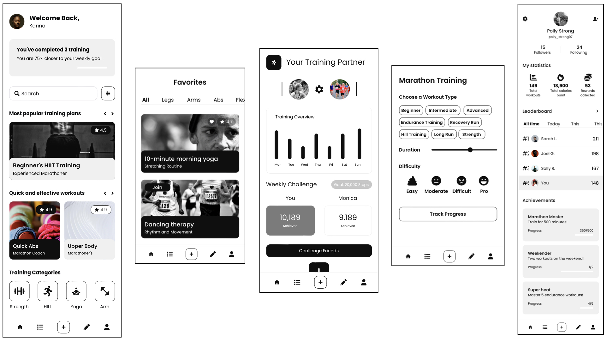

# Marathon Master

## Table of Contents

1. [Overview](#Overview)
2. [Product Spec](#Product-Spec)
3. [Wireframes](#Wireframes)
4. [Schema](#Schema)

## Overview

### Description

Marathon Master is a comprehensive mobile app designed to help users train for a marathon effectively. It leverages a community-driven approach to create a supportive and informative environment for marathon enthusiasts. The app offers the following features:

1. Training Feed: Users can follow experienced marathon runners and trainers, creating a personalized feed of training plans, tips, and progress updates. This feature allows users to learn from the experiences of others and gather insights into effective training strategies.
2. Personalized Training Plans: Marathon Master provides users with the ability to create personalized marathon training plans based on their fitness level, goals, and available time. 
3. Training Log: Users can log their daily workouts, including running distances, times, and other relevant data. The app tracks progress over time, providing insights and visual representations of their journey.
4. Community Engagement: Users can interact with other members of the Marathon Master community through comments, likes, and direct messaging. They can seek advice, share their achievements, and build a network of support.

### App Evaluation

   - **Category:** Fitness
   - **Mobile:** Marathon Master's mobile experience is unique, as it gives the users the ability to control their own practice and goals in achieveing a marathon while learning from other individuals who are either working towards the same goal or have already achived it.
   - **Story:** The app's story is compelling for marathon aspirants who seek guidance and motivation during their training. It provides clear value through personalized training plans, learning from others, and a supportive community. Friends and peers interested in marathon running would likely respond positively to this idea.
   - **Market:** The market for marathon training apps is substantial, and Marathon Master can cater to both novice and experienced runners. It offers value to those training for marathons and those looking to improve their running skills.
   - **Habit:** Marathon Master has the potential to be habit-forming, especially for users committed to marathon training. Daily engagement for tracking workouts and staying connected with the community can encourage habitual usage.
   - **Scope:** Developing the core features for creating training plans, logging workouts, and building a community is achievable within a reasonable timeframe. A simplified version focusing on personalized training plans and workout logging can be a valuable starting point.

## Product Spec

### 1. User Stories (Required and Optional)

**Required Must-have Stories**

* User can create a new training plan.
* User can log a workout (distance, time, date, route, etc.).
* User can view and edit their training log.
* User can see a personalized feed of training plans and progress updates from other users.
* User can search for other users and training plans.
* User can view their own profile page with their training plans and workout history.
* User can edit their profile information, including their bio, profile picture, and running preferences.

**Optional Nice-to-have Stories**
* User can see trending training plans and workouts.
* User can search for training plans and workouts by hashtags.
* Users can follow specific runners
* User can see a list of their followers and those they follow.
* User can view other users' profiles to see their training plans, workouts, and follower/following lists.
* User can tap a training plan or workout to view a more detailed screen with comments and insights.
* User can create and join running challenges or groups.
* User can share their workout progress and achievements on their feed.
* User can see statistics and insights about their training progress (e.g., total distance, pace, personal records).
* User can integrate with fitness wearables and devices to sync workout data automatically.

### 2. Screen Archetypes

- [ ] Login / Register
  * Login Screen - User can log in to their existing account.
  * Registration Screen - User can create a new Marathon Master account.

- [ ] Stream
  * Personalized Feed - User can scroll through their personalized feed of training plans, workouts, and updates from users they follow.
  * Trending Feed (Optional) - User can view trending training plans and workouts.

- [ ] Detail
  * Training Plan Detail - User can view detailed information about a specific training plan, including the schedule and user comments.
  * Workout Detail - User can see more information about a specific workout, including distance, time, route, and comments.

- [ ] Creation
  * Create Training Plan - User can create a new training plan, setting goals, schedule, and descriptions.
  * Log Workout - User can create a new workout entry, including details like distance, time, date, and route
  * Comment Entry - User can compose and post comments on training plans and workouts.

- [ ] Profile
  * User Profile - User can view their profile page, displaying their training plans, workouts, follower/following lists, and bio.
  * Other User Profile - User can view the profile page of another user to see their training plans, workouts, follower/following lists, and bio.

- [ ] Settings
  * App Settings - User can configure app options, including notification preferences, privacy settings, and account settings.
  

### 3. Navigation

**Tab Navigation** (Tab to Screen)

* Home Feed - This is the default screen where users can see their personalized feed of training plans and workouts.
* Explore - Users can discover new training plans, workouts, and trending content.
* Create - Users can create new training plans and log workouts.
* Profile - Users can access their profile page to view their training history and interact with their followers and following lists.
* Settings - Users can access app settings, including notification preferences and account settings.

**Flow Navigation** (Screen to Screen)

- [ ] Login Screen
	* Login Screen => Home Feed
	* Login Screen => Registration Screen

- [ ] Registration Screen
	* Registration Screen => Home Feed

- [ ] Home Feed
	* Home Feed => Training Plan Detail
	* Home Feed => Workout Detail
	* Home Feed => Create Training Plan
	* Home Feed => Log Workout
	* Home Feed => Other User Profile

- [ ] Training Plan Detail
	* Training Plan Detail => Home Feed (back to feed)
	* Training Plan Detail => Workout Detail
	* Training Plan Detail => Other User Profile

- [ ] Workout Detail
	* Workout Detail => Home Feed (back to feed)
	* Workout Detail => Training Plan Detail
	* Workout Detail => Other User Profile

- [ ] Create Training Plan
	* Create Training Plan => Home Feed (after creating a plan)
	* Create Training Plan => Add Training Plan Details (if additional screens are required to set up the plan)
	* Create Training Plan => Edit Plan (if the user wants to make changes)

- [ ] Log Workout
	* Log Workout => Home Feed (after logging a workout)
	* Log Workout => Select Training Plan (if the user wants to associate the workout with a specific plan)
	* Log Workout => Edit Workout (if the user wants to make changes)

- [ ] Other User Profile
	* Other User Profile => Home Feed (navigate back to the feed)
	* Other User Profile => Training Plan Detail (view the user's training plans)
	* Other User Profile => Workout Detail (view the user's workouts)
	* Other User Profile => Follow/Unfollow (if the user decides to follow/unfollow)

- [ ] Settings
	* Settings => Home Feed (back to the feed)
	* Settings => Profile (view and edit profile settings)
	* Settings => Notifications (configure notification preferences)
	* Settings => Privacy (configure privacy settings)
	* Settings => Log Out (log out of the app)

## Wireframes

### [BONUS] Interactive Prototype

## Schema 
[This section will be completed in Unit 9]

### Models
[Add table of models]

### Networking
- [Add list of network requests by screen ]
- [Create basic snippets for each Parse network request]
- [OPTIONAL: List endpoints if using existing API such as Yelp]# marathon-master
# marathon-master
# marathon-master
